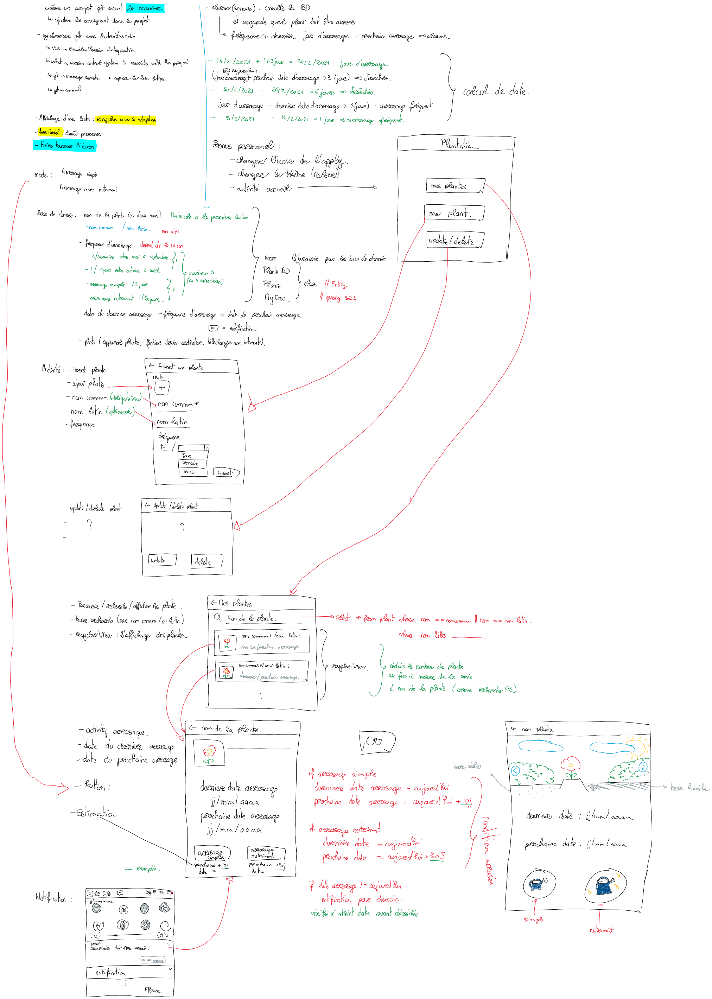
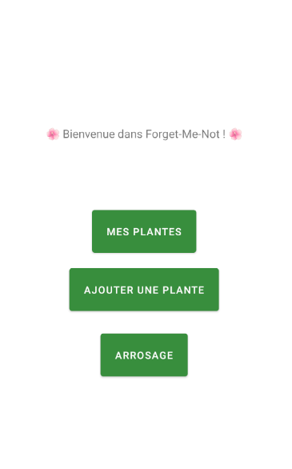
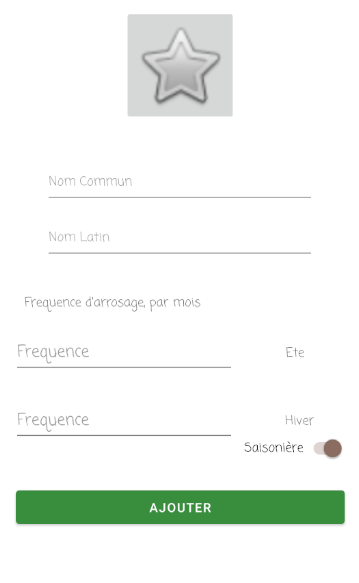
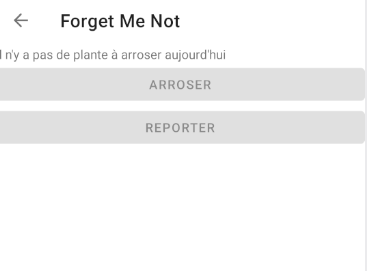

# Forget Me Not

>Projet de programation de composantes mobiles de Thomas Bignon et Laura Wang.

## Description :

Le sujet est disponible [ici](docs/sujet.pdf). Le but est de construire une application pour aider les amateurs de fleurs à penser à bien arroser leurs différentes fleurs au bon moment.

## Installation 

* Télécharger notre fichier 
* Importer le fichier dans AndroidStudio
* Lancer l'application dans un émulateur ou brancher votre téléphone android

## Structure du projet

Il s'agit d'une structure du projet à main léver au début du développement : 

## Capture d'écran

La page d'accueil de notre application

Ajouter une nouvelle plante

Arroser les plantes

Le système de notification

